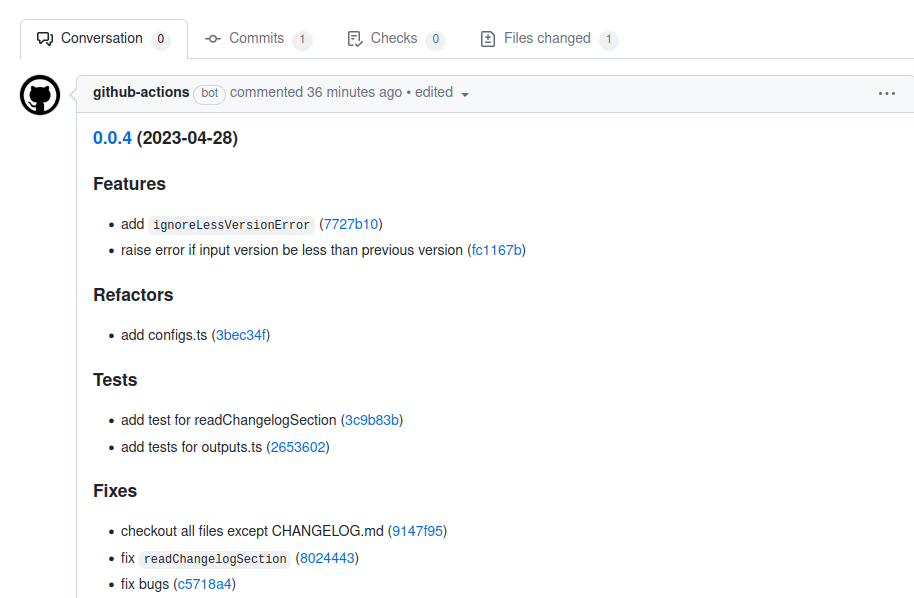

<div align="center">
  <h1>Create Changelog GitHub Action</h1>
  <br />
  <a href="#getting-started"><strong>Getting Started »</strong></a>
  <br />
  <br />
  <a href="https://github.com/Payadel/changelog-sv-action/issues/new?assignees=&labels=bug&template=BUG_REPORT.md&title=bug%3A+">Report a Bug</a>
  ·
  <a href="https://github.com/Payadel/changelog-sv-action/issues/new?assignees=&labels=enhancement&template=FEATURE_REQUEST.md&title=feat%3A+">Request a Feature</a>
  .
  <a href="https://github.com/Payadel/changelog-sv-action/issues/new?assignees=&labels=question&template=SUPPORT_QUESTION.md&title=support%3A+">Ask a Question</a>
</div>

<div align="center">
<br />


[](https://github.com/Payadel/changelog-sv-action/issues?q=is%3Aissue+is%3Aopen+label%3A%22help+wanted%22)
[](https://github.com/Payadel)

</div>

## About

`changelog-sv-action` is a GitHub action for generating a changelog based on
the [standard-version](https://www.npmjs.com/package/standard-version) npm package. The purpose of this action is to
automate the process of generating changelogs for software projects.

Maintaining a clear and concise changelog is an important aspect of software development, as it allows users and
contributors to easily understand what changes have been made in each version of the software. However, manually
creating and maintaining a changelog can be a time-consuming and error-prone task.

This action solves the problem of generating changelogs by automating the process using the `standard-version` package.
It can detect new versions or get a version from the GitHub Action inputs, and it validates the input version to ensure
that it is not equal to or less than the current version. The action also allows for errors to be ignored using the
action inputs.

The `changelog-sv-action` generates a new changelog, updates the `CHANGELOG.md` file, and returns only the new section
as a GitHub Action output. It also returns the new version as `version`. This action only updates the `CHANGELOG.md`
file so that a pull request can be created in other steps if desired.

By automating the process of generating changelogs, this action helps to save time and reduce errors. It also ensures
that the changelog is consistent and up-to-date, which is important for maintaining a transparent and well-documented
software project.

### Demo

<details>
<summary>Screenshots</summary>
<br>



</details>

### Built With

* Typescript

## Getting Started

To use `changelog-sv-action` in your GitHub workflow, you need to add the action to your repository and configure it
with the appropriate inputs.

### Prerequisites

Before using `changelog-sv-action`, ensure that your project has the following:

- `package.json` file with a valid version number: This project is based `standard-version` npm package that uses
  the `package.json` for managing versions.

## Usage

Add the `changelog-sv-action` to your GitHub workflow.

```yaml
on:
  push:
    branches:
      - main
  workflow_dispatch:
    inputs:
      version:
        required: false
        default: ''

permissions:
  contents: write
  pull-requests: write

jobs:
  generate-changelog:
    runs-on: ubuntu-latest
    steps:
      - uses: actions/checkout@v3
        with:
          fetch-depth: 0

      - name: Generate Changelog
        uses: payadel/changelog-sv-action@v0.0.4  # Ensure version is latest
        id: changelog
        with:
          version: '${{ inputs.version }}'
          ignore-same-version-error: 'false'
          ignore-less-version-error: 'false'

      - name: Create Pull Request
        uses: peter-evans/create-pull-request@v5
        with:
          commit-message: "chore(changelog): update CHANGELOG.md for v${{ steps.changelog.outputs.version }}"
          branch: changelog
          delete-branch: true
          title: 'Changelog v${{ steps.changelog.outputs.version }}'
          body: ${{ steps.changelog.outputs.changelog }}
          assignees: ${{ github.actor }} <${{ github.actor }}@users.noreply.github.com>
```

### Documentation

## Inputs

`changelog-sv-action` has the following inputs:

| Name                        | Description                                                                                                                                       | Required | Default |
|-----------------------------|---------------------------------------------------------------------------------------------------------------------------------------------------|----------|---------|
| `version`                   | The specific version to generate the changelog for. If not provided, `standard-version` will detect the next version based on the commit history. | `false`  | `''`    |
| `ignore-same-version-error` | Whether to ignore the error that occurs when the provided version is the same as the current version.                                             | `false`  | `false` |
| `ignore-less-version-error` | Whether to ignore the error that occurs when the provided version is less than the current version.                                               | `false`  | `false` |
| `changelog-version-regex`   | The regex with which we find the version lines in the changelog file.                                                                             | `false`  | `''`    |

## Outputs

`changelog-sv-action` has the following outputs:

| Name        | Description                                                       |
|-------------|-------------------------------------------------------------------|
| `version`   | The version that was produced by `standard-version`.              |
| `changelog` | The new section of the changelog generated by `standard-version`. |

## CHANGELOG

Please read [CHANGELOG.md](CHANGELOG.md)

## Features

`changelog-sv-action` provides the following features:

- Uses the `standard-version` npm package to manage versions and generate the changelog.
- Generates a changelog based on the commits since the last release.
- Updates the `CHANGELOG.md` file with the new section.
- Returns the new version and the new changelog section as outputs.
- Validates the input version to ensure it is greater than the current version.
- Ignores validation errors if specified in the inputs.

`changelog-sv-action` is useful for developers who want to automate the process of generating a changelog for their projects. It saves time and ensures that the changelog is always up-to-date with the latest changes. Additionally, it helps maintain consistency in versioning and changelog formatting across multiple projects.

## Roadmap

See the [open issues](https://github.com/Payadel/changelog-sv-action/issues) for a list of proposed features (and known
issues).

- [Top Feature Requests](https://github.com/Payadel/changelog-sv-action/issues?q=label%3Aenhancement+is%3Aopen+sort%3Areactions-%2B1-desc) (
  Add your votes using the 👍 reaction)
- [Top Bugs](https://github.com/Payadel/changelog-sv-action/issues?q=is%3Aissue+is%3Aopen+label%3Abug+sort%3Areactions-%2B1-desc) (
  Add your votes using the 👍 reaction)
- [Newest Bugs](https://github.com/Payadel/changelog-sv-action/issues?q=is%3Aopen+is%3Aissue+label%3Abug)

## Support

Reach out to the maintainer at one of the following places:

- [GitHub issues](https://github.com/Payadel/changelog-sv-action/issues/new?assignees=&labels=question&template=SUPPORT_QUESTION.md&title=support%3A+)

## FAQ

#### Q: Why should I use `changelog-sv-action` instead of manually generating the changelog?

A: Manually generating a changelog can be time-consuming and error-prone. `changelog-sv-action` automates the process and ensures that the changelog is always up-to-date with the latest changes. Additionally, it helps maintain consistency in versioning and changelog formatting across multiple projects.

#### Q: Can I specify the version number to generate the changelog for?

A: You can specify the version number using the `version` input. If not provided, `standard-version` will detect the next version based on the commit history.

#### Q: What happens if the provided version is less than or equal to the current version?

A: By default, `changelog-sv-action` will fail if the provided version is less than or equal to the current version. However, you can ignore these errors by setting `ignore-same-version-error` and `ignore-less-version-error` inputs to `true`.

#### Q: How does `changelog-sv-action` update the `CHANGELOG.md` file?

A: `changelog-sv-action` uses the `standard-version` npm package to manage versions and generate the changelog. It updates the `CHANGELOG.md` file with the new section and adds an entry for the new version.

#### Q: Can I use `changelog-sv-action` in my workflow?

A: Yes, you can use `changelog-sv-action` in your GitHub Actions workflow. Simply add it as a step in your workflow and provide the necessary inputs.

## Project assistance

If you want to say **thank you** or/and support active development of `changelog-sv-action`:

- Add a [GitHub Star](https://github.com/Payadel/changelog-sv-action) to the project.
- Tweet about the `changelog-sv-action`.
- Write interesting articles about the project on [Dev.to](https://dev.to/), [Medium](https://medium.com/) or your
  personal blog.

Together, we can make `changelog-sv-action` **better**!

## Contributing

First off, thanks for taking the time to contribute! Contributions are what make the free/open-source community such an
amazing place to learn, inspire, and create. Any contributions you make will benefit everybody else and are **greatly
appreciated**.

Please read [our contribution guidelines](docs/CONTRIBUTING.md), and thank you for being involved!

## Authors & contributors

The original setup of this repository is by [Payadel](https://github.com/Payadel).

For a full list of all authors and contributors,
see [the contributors page](https://github.com/Payadel/changelog-sv-action/contributors).

## Security

`changelog-sv-action` follows good practices of security, but 100% security cannot be assured. `changelog-sv-action` is provided **"as
is"** without any **warranty**.

_For more information and to report security issues, please refer to our [security documentation](docs/SECURITY.md)._

## License

This project is licensed under the **GPLv3**.

See [LICENSE](LICENSE) for more information.

## Related

Here are some related projects

- [Standard Version](https://www.npmjs.com/package/standard-version)


